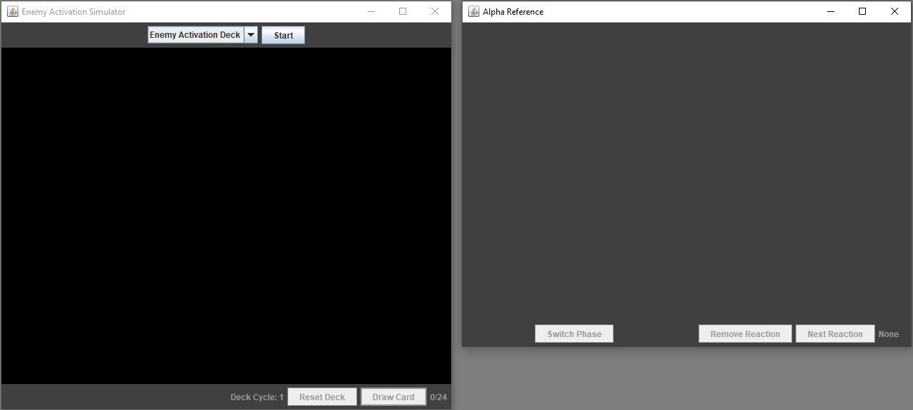
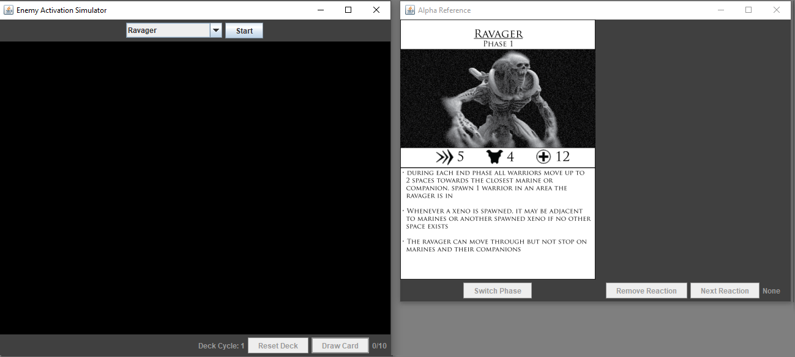
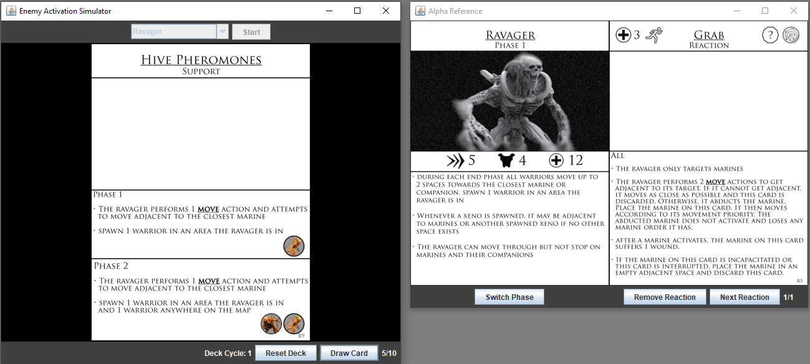
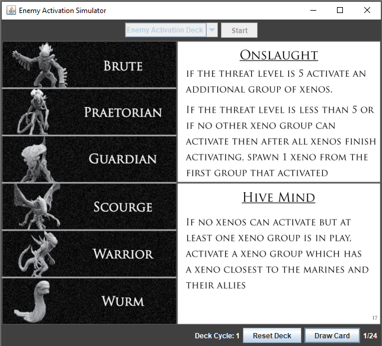

# Enemy-Activation-Simulator
A Graphical User Interface for rapid prototyping of some of the enemy action decks for my boardgame, Lockdown.

Features
---------
- Keyboard Navigation and shortcuts.
    
     - Tab moves the focus between both windows if they are displayed
     - Space and Enter will either start a session, draw a card or cycle to the next reaction card
       depending on which window is focused and whether a scenario has been started or not
     - R will reset the program or remove one of the in play reaction cards
     - S will cycle which boss phase is displayed
     - Up and Down arrow keys will select which deck you are playing with
       
- Automatic save stating if you close the program
- Easy ability to add more decks without any code changes

Screenshots
-----------
- Initial Display

- Display after choosing a boss deck

- In play boss 

- In play normal deck
  

